# 🖼️ 화상 캐리커처 플랫폼 <Sketchme>

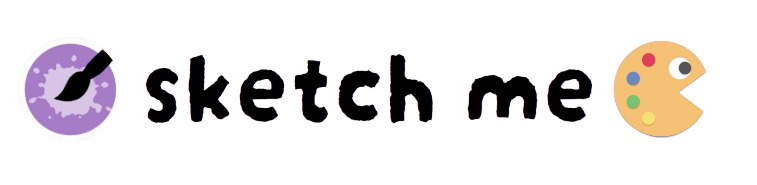

# Link

- [Visit Project Repository](https://lab.ssafy.com/s09-webmobile1-sub2/S09P12A406)
- [Visit Notion Page](https://www.notion.so/0f2e0b26976d46ad97065bbc6050cd99?pvs=21)

# 목차

# Guide

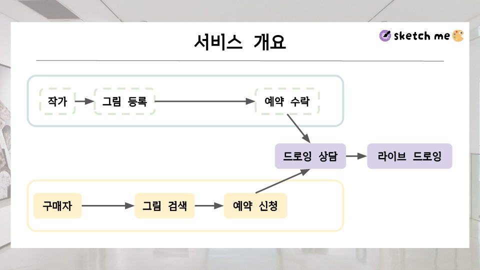

### 고객

1. 로그인을 통해 메인 페이지에 입장한다.
2. 대시보드 페이지 상단에 있는 작가 검색 창에 원하는 작가 또는 태그를 입력한다.
3. 검색 결과 페이지에서 원하는 작가의 프로필을 클릭한다.
4. 작가에게 채팅을 보내거나, 예약을 신청한다.
5. 작가가 예약을 승인하면, 지정된 시간에 `봇` 이 예약 알림 채팅을 보낸다.
6. 채팅 안에 있는 화상 회의 입장 버튼을 눌러 화상 회의에 입장한다.

### 작가

1. 로그인을 통해 메인 페이지에 입장한다.
2. 대시보드 페이지 상단에 있는 `작가 전환` 버튼을 누른다.
3. 작가 전환 페이지에서 `작가 전환` 버튼을 눌러 작가로 전환한다.
    1. 작가로 전환한 후에는 작가이면서, 고객으로 활동할 수 있다.
4. 하단의 채팅 버튼을 눌러, 지금까지 도착한 채팅 목록을 볼 수 있다.
5. 예약 신청 채팅이 도착하면, 예약을 승인할지 거부할지 여부를 결정할 수 있다.
6. 작가가 예약을 승인하면, 지정된 시간에 `봇` 이 예약 알림 채팅을 보낸다.
7. 채팅 안에 있는 화상 회의 입장 버튼을 눌러 화상 회의에 입장한다.

## 시연
<!-- 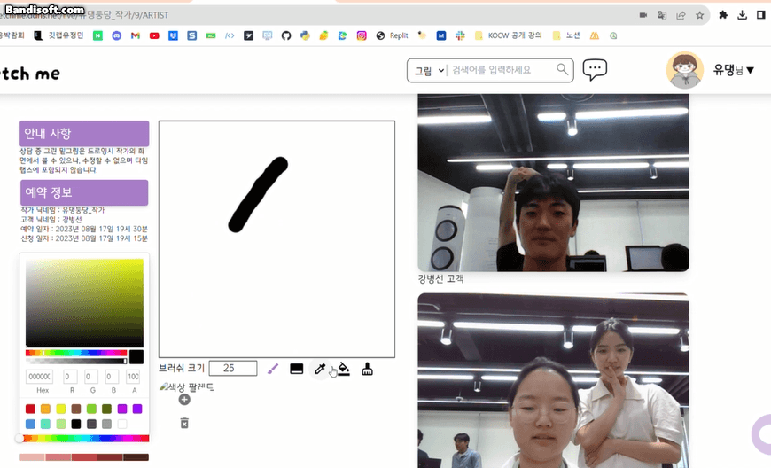 -->
<!-- 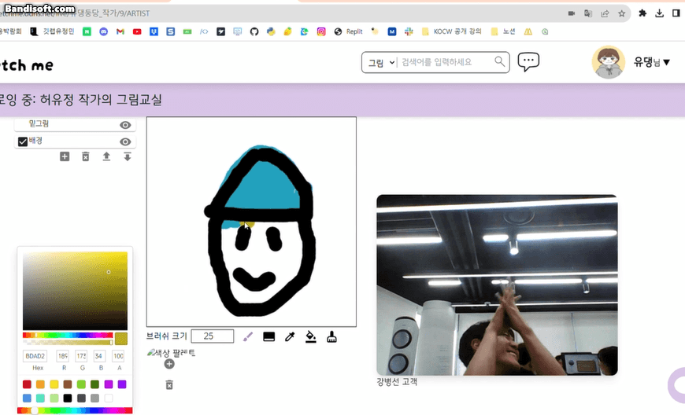 -->

## Dev 서버 구동 방법

아래 코드를 터미널에 붙여 넣습니다.

### git clone

git clone [https://github.com/JoeSeongchan/sketchme](https://github.com/JoeSeongchan/sketchme)

### Docker 설치

```powershell
# 기반 프로그램 설치 
sudo apt update;
sudo apt upgrade -y;
sudo apt install apt-transport-https ca-certificates -y;
sudo apt install curl gnupg-agent software-properties-common -y;

# Docker의 공식 GPG 키 추가
curl -fsSL <https://download.docker.com/linux/ubuntu/gpg> | sudo apt-key add;

# Stable Repo 추가
sudo add-apt-repository "deb [arch=amd64] <https://download.docker.com/linux/ubuntu> bionic stable";

# Update
sudo apt update;

# Docker 설치
sudo apt install docker-ce docker-ce-cli containerd.io -y;

# Docker 버전 확인 
docker -v;
```

### Infra (Redis, MariaDB, Kafka, Zookeeper) 설치

```powershell
# Docker Compose 구성 파일 위치로 이동
cd ./sketchme/infra;
./i-infra.sh; # i-infra = install-infra
```

### Spring Batch 서버 설치

```powershell
# Docker Compose 구성 파일 위치로 이동
cd ./sketchme/infra;
./i-batch.sh; # i-batch = install-spring-batch
```

### OpenVidu 서버 설치

```powershell
# Docker Compose 구성 파일 위치로 이동
cd ./sketchme/infra;
./i-openvidu; # i-openvidu = install-openvidu
```

### Spring Boot API 서버 설치

```powershell
# Docker Compose 구성 파일 위치로 이동
cd ./sketchme/infra;
./i-api; # i-api = install-spring-boot-api
```

## 개발 배경

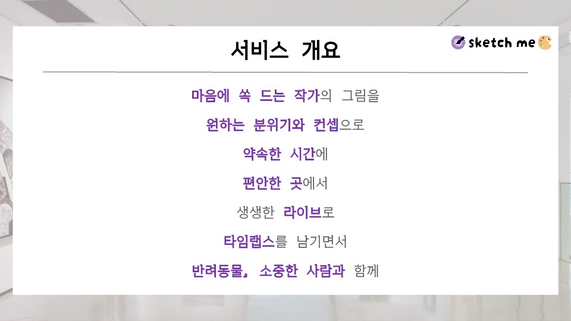

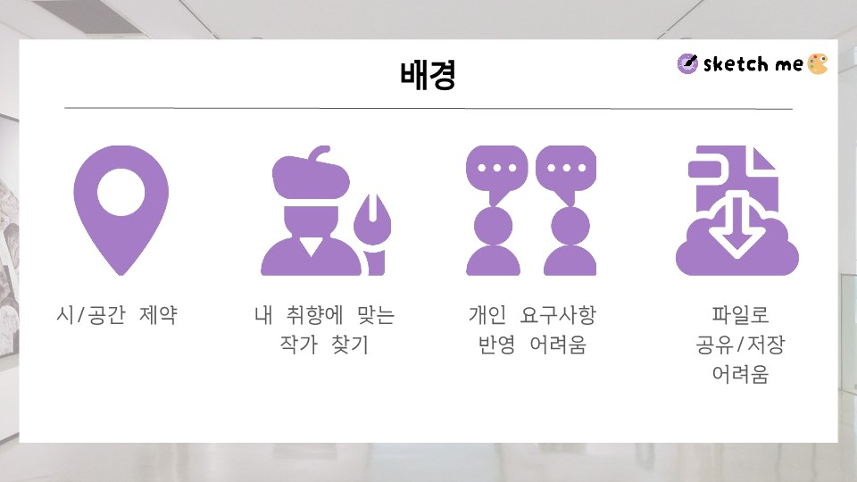

## 아키텍처

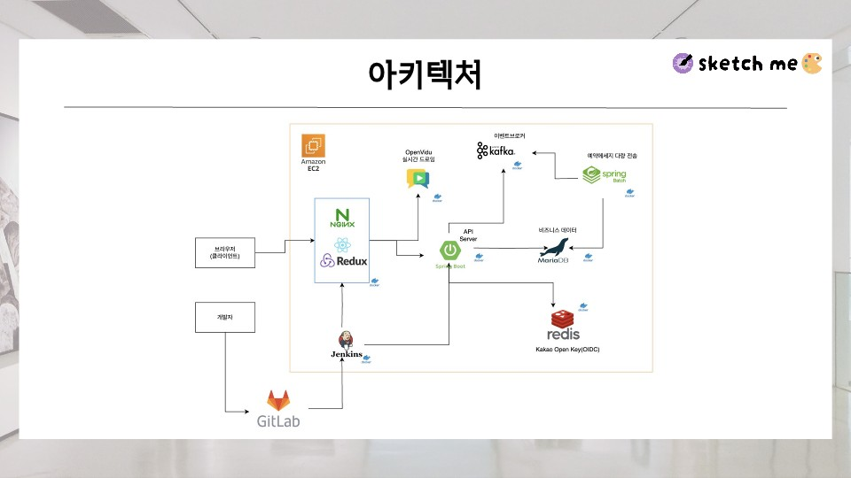
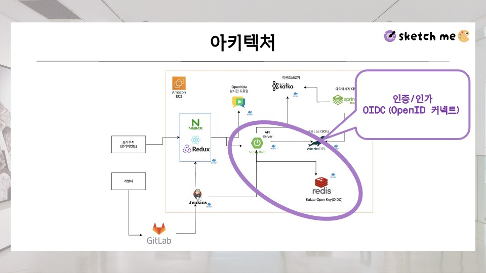
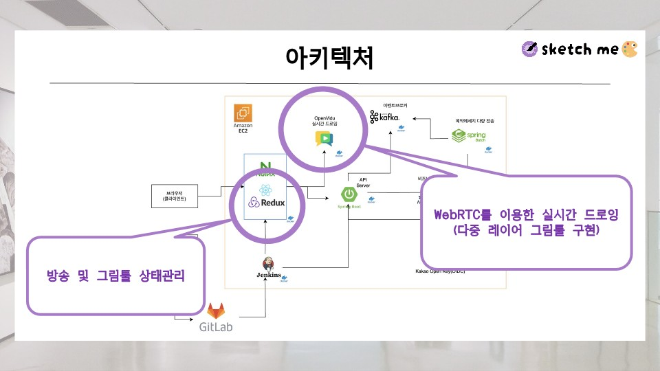
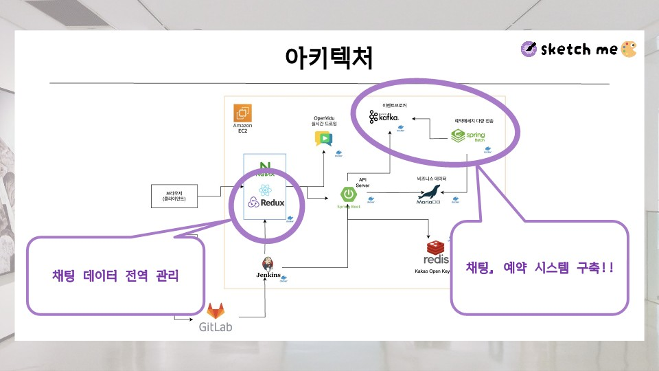
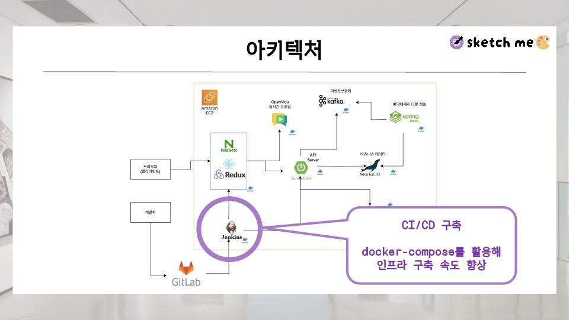
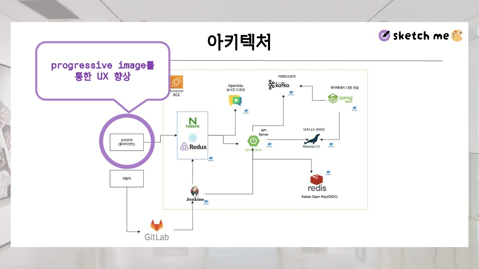

# 폴더 구조

### Backend

```
src
 ┣ main
 ┃ ┣ java
 ┃ ┃ ┗ com
 ┃ ┃ ┃ ┗ dutaduta
 ┃ ┃ ┃ ┃ ┗ sketchme
 ┃ ┃ ┃ ┃ ┃ ┣ aop
 ┃ ┃ ┃ ┃ ┃ ┣ chat
 ┃ ┃ ┃ ┃ ┃ ┃ ┣ config
 ┃ ┃ ┃ ┃ ┃ ┃ ┣ constant
 ┃ ┃ ┃ ┃ ┃ ┃ ┣ controller
 ┃ ┃ ┃ ┃ ┃ ┃ ┣ dao
 ┃ ┃ ┃ ┃ ┃ ┃ ┣ domain
 ┃ ┃ ┃ ┃ ┃ ┃ ┣ dto
 ┃ ┃ ┃ ┃ ┃ ┃ ┗ service
 ┃ ┃ ┃ ┃ ┃ ┣ common
 ┃ ┃ ┃ ┃ ┃ ┣ config
 ┃ ┃ ┃ ┃ ┃ ┣ file
 ┃ ┃ ┃ ┃ ┃ ┣ global
 ┃ ┃ ┃ ┃ ┃ ┣ mattermost
 ┃ ┃ ┃ ┃ ┃ ┣ meeting
 ┃ ┃ ┃ ┃ ┃ ┣ member
 ┃ ┃ ┃ ┃ ┃ ┣ product
 ┃ ┃ ┃ ┃ ┃ ┣ videoconference
 ┃ ┗ resources
 ┗ test
 ┃ ┗ java
 ┃ ┃ ┗ com
 ┃ ┃ ┃ ┗ dutaduta
 ┃ ┃ ┃ ┃ ┗ sketchme
 ┃ ┃ ┃ ┃ ┃ ┣ product
 ┃ ┃ ┃ ┃ ┃ ┣ review
 ┃ ┃ ┃ ┃ ┃ ┣ videoconference
```

## Skills

### Frontend

- React
    - Recoil
- Tailwind CSS
- Axios

### Backend

- Java
- Spring Boot
- Spring Batch
- Gradle
- dependencies
    - WebSocket
    - Spring Security
    - JPA
    - Validation
- MariaDB

### Server

- AWS EC2
- Docker, Docker Compose
- Jenkins

## Team

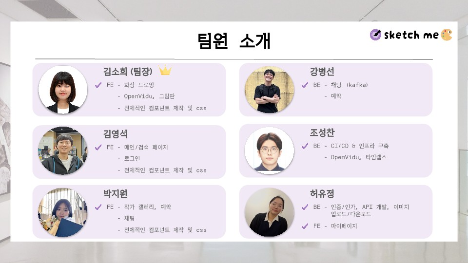

# Project Control

Version Control: Git, GitLab

Task Control: Notion, Figma, Jira, Mattermost

## 기타

[Convention](https://www.notion.so/Convention-5f47ce6130d24f02a0d3fe1fef1216db?pvs=21)

[백엔드 합의 사항](https://www.notion.so/02dc13cb26164e278210d0b704c925b8?pvs=21)

[프론트엔드 합의 사항](https://www.notion.so/f14e057737954697a389703a40485854?pvs=21)

[산출물](https://www.notion.so/262d0891430441a0ac1bdd6dac023a52?pvs=21)

[배운 것](https://www.notion.so/bef45e61c074477bb5aad59d168bab3a?pvs=21)

[트러블 슈팅](https://www.notion.so/1acc1c22f7474a94986fae0767e742d8?pvs=21)