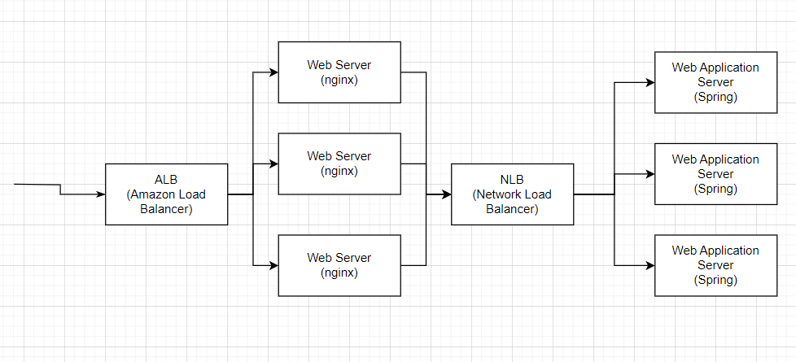

# TIL

날짜: 2023년 7월 17일

# 화면 설계서와 기능 명세서

[화면설계서 (Wireframe)와 기능명세서 (Functional Specification)](https://mklab-co.medium.com/작성법-화면설계서-wireframe-와-기능명세서-functional-specification-bbcff0071ea2)

# 화면 설계서와 화면 흐름도

[화면흐름도 (Screen Flow chart)와 IA(Information Architecture)](https://mklab-co.medium.com/작성법-화면흐름도-screen-flow-chart-와-ia-information-architecture-2a3facc3bf96)

# 요구사항 명세서와 기능 명세서

요구사항 명세서는 **요구사항 수집 단계**에서 나오는 산출물이고, 기능 명세서는 요구사항 분석에서 나오는 산출물이라고 볼 수 있다.

요구사항 명세서는 **외주 업체에서 원하는 요구사항**들을 적어 놓은 문서이다. 기능 명세서는 요구사항 명세서의 내용을 바탕으로 각 요구사항의 **우선순위**를 정하고, 주어진 기간 내에 개발할 요구사항들만을 모아 놓은 문서다. 

[기능 명세서, 요구사항 정의서는 무엇일까?](https://brunch.co.kr/@uxuxlove/123)

[요구사항 명세서 (Requirements Specification)](https://mklab-co.medium.com/작성법-요구사항-명세서-requirements-specification-ad3533d6d5b8)

# nginx란?

Nginx는 오픈 소스 웹 서버 프로그램이다.

## 용도

1. 정적 파일 서버
2. 리버스 프록시 서버
3. 로드 밸런서
4. HTTP 캐시 
5. SSL/TLS 종단점

# alb, nlb란?

1. ALB (Application Load Balancer):
ALB는 아마존 웹 서비스(AWS)에서 제공하는 **로드 밸런서** 서비스이다. ALB는 OSI 7계층에서 동작하며, HTTP 및 HTTPS 트래픽을 기반으로 한 웹 애플리케이션에 특화되어 있다. ALB는 클라이언트 요청을 여러 대의 EC2 인스턴스, 컨테이너, Lambda 등의 백엔드 서비스로 분산시켜준다. 또한, 요청 라우팅, 세션 관리, SSL/TLS 종료 및 보안 기능 등 다양한 기능을 제공한다. ALB는 Elastic Load Balancing 서비스의 일부로 제공되며, 많은 웹 애플리케이션에서 사용된다.
    - alb는 https 설정도 간단하다.
2. NLB (Network Load Balancer):
NLB도 AWS에서 제공하는 로드 밸런서 서비스이다. NLB는 OSI 4계층에서 동작하며, TCP, UDP 및 TLS 트래픽을 로드 밸런싱할 수 있다. NLB는 고성능 및 초고처리량을 위해 설계되었으며, 대규모 네트워크 트래픽을 처리하는 데 특히 효과적이다. NLB는 EC2 인스턴스, 컨테이너 등의 백엔드 서비스로 트래픽을 분산시킨다. NLB는 Elastic Load Balancing 서비스의 일부로 제공되며, 성능과 확장성이 요구되는 애플리케이션에서 주로 사용된다.
    - nlb가 4계층까지만 검토해서 성능은 좋지만 **유연성은 떨어진다**.

## alb, nlb를 활용해서 대용량 트래픽 수용 서버 설계

`alb→web server→nlb→web application server`

- web server와 web application server를 오토스케일링한다. 웹 어플리케이션 서버뿐만 아니라 웹 서버에도 부하가 걸리는 경우를 고려한다. 트래픽이 많아지면 web server와 web application server 수가 자동으로 늘어난다.
- 웹 서버와 앱 서버 둘 다 private subnet 안에 있다. alb을 통해야만 private subnet으로 들어갈 수 있다. alb에서 인증 / 인가를 하여 권한이 있는 경우에만 웹 서버에 접근할 수 있다.
- 도메인은 alb에 할당되어 있다. 우리 도메인에 요청이 오면 alb로 가고, alb가 맞는 web server(nginx)에게 요청을 할당한다. 만약 정적 자원이 아닌 동적 자원을 요청한다면 그 요청을 nlb에 전달한다. nlb가 웹 어플리케이션 서버들에게 요청을 분산하여 전달한다.

