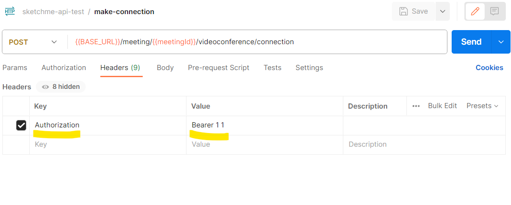

Local에서는 Spring Security, JWT Token 인증을 해제했습니다. 그래서 카카오 계정으로 로그인할 필요가 없습니다.

Postman에서 Header 키를 'Authorization' 로 하고, 값을 'Bearer {user id} {artist id}' 로 설정하면, 헤더에서 문자열을 읽어서 공백을 기준으로 잘라 앞 숫자는 유저의 user id로, 뒷 숫자는 유저의 artist id로 삼습니다.

위 그림을 참고해서 PostMan을 세팅하세요.

테스트 용으로만 이렇게 설정하는 것이니, **절대로** Dev, Prod 환경에 적용하지 마세요.